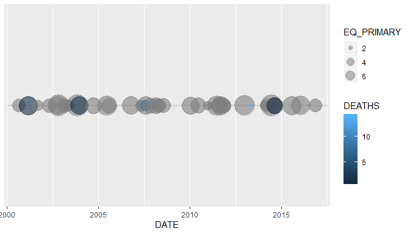
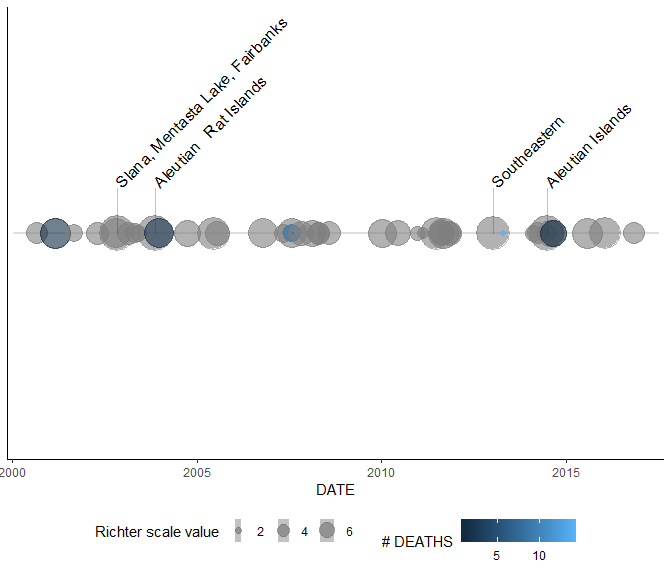

<!-- README.md is generated from README.Rmd. Please edit that file -->

# NOAAPackage

<!-- badges: start -->

<!-- badges: end -->

The goal of NOAAPackage is to display information on destructive
earthquakes from 2150 B.C. to the present provided by the National
Centers For Environmental Information on <https://www.ngdc.noaa.gov>.

## Installation

You can install the released version of NOAAPackage from
[CRAN](https://CRAN.R-project.org) with:

``` r
# install.packages("devtools")
devtools::install_github("PatGruetter/NOAAPackage")
```

## Usage

The package contains a function to read the data and another one to
clean to clean it. Moreover, two geoms are available to visualize and
label earthquakes on a time line, respectively, as well as two functions
to display and label eathquakes on a map, respectively.

First, let’s load the necessary packages:

``` r
library(NOAAPackage)
library(tidyverse)
```

Data can be read into R using the function *noaa\_read()*:

``` r
noaa_data <- noaa_read(system.file("extdata",
                                   "NOAA Significant Earthquake Database.txt",
                                   package ="NOAAPackage"))
```

The data set needs to be cleaned using the function *eq\_clean\_data()*
so that the data can later be used with the provided geoms and functions
for visualizations and map plots.

``` r
noaa_data_cleaned <- noaa_data %>% 
  eq_clean_data()
```

Let’s have a look at the geom called *geom\_timeline()* and at the plot
it makes:

``` r
usa_data <- noaa_data_cleaned %>%
  filter(str_trim(COUNTRY) %in% c("USA") & DATE %in% c(ymd("2000-01-01"):ymd("2017-01-01")))

ggplot(data = usa_data) +
    geom_timeline(aes(x = DATE, color = DEATHS, size=EQ_PRIMARY), alpha=0.6)
```



If you want to add lables to the n\_max largest earthquakes, you can add
another geom called *geom\_timeline\_label()* after *geom\_timeline()*:

``` r
ggplot(data = usa_data) +
    geom_timeline(aes(x = DATE, color = DEATHS, size=EQ_PRIMARY), alpha=0.6) + 
    geom_timeline_label(aes(label = LOCATION_NAME, x = DATE, size=EQ_PRIMARY, n_max = 4)) +
    guides(size = guide_legend(title = "Richter scale value")) +
    scale_colour_continuous(name = "# DEATHS") +
    theme_classic() +
    theme(legend.position="bottom")
```



Earthquakes can also be shown on a map using the NOAA package functions
for data cleaning, i.e. *eq\_clean\_data()* as well as the function to
display the earthquake locations on a map, i.e. *eq\_map()*. If you
click on one of the locations, the date of the earthquake pops up.

``` r
noaa_data %>%
    eq_clean_data() %>%
    dplyr::filter(COUNTRY == "MEXICO" & lubridate::year(DATE) >= 2000) %>% 
    eq_map(annot_col = "DATE")
```

<!--html_preserve-->

<div id="htmlwidget-48bd586b82bad3f63c25" class="leaflet html-widget" style="width:100%;height:576px;">

</div>

<script type="application/json" data-for="htmlwidget-48bd586b82bad3f63c25">{"x":{"options":{"crs":{"crsClass":"L.CRS.EPSG3857","code":null,"proj4def":null,"projectedBounds":null,"options":{}}},"calls":[{"method":"addTiles","args":["//{s}.tile.openstreetmap.org/{z}/{x}/{y}.png",null,null,{"minZoom":0,"maxZoom":18,"tileSize":256,"subdomains":"abc","errorTileUrl":"","tms":false,"noWrap":false,"zoomOffset":0,"zoomReverse":false,"opacity":1,"zIndex":1,"detectRetina":false,"attribution":"&copy; <a href=\"http://openstreetmap.org\">OpenStreetMap<\/a> contributors, <a href=\"http://creativecommons.org/licenses/by-sa/2.0/\">CC-BY-SA<\/a>"}]},{"method":"addCircleMarkers","args":[[18.194,32.319,16.87,18.77,17.488,26.319,17.302,32.456,32.437,32.297,16.396,17.844,16.493,16.878,17.397,17.235,14.728,17.682,15.802,14.761,18.339,16.626,16.646,14.763],[-95.908,-115.322,-100.113,-104.104,-101.303,-86.606,-100.198,-115.315,-115.165,-115.278,-97.782,-99.963,-98.231,-99.498,-100.972,-100.746,-92.578,-95.653,-93.633,-94.103,-98.68,-95.078,-97.653,-92.298],10,null,null,{"interactive":true,"className":"","stroke":true,"color":"#03F","weight":1,"opacity":0.5,"fill":true,"fillColor":"#03F","fillOpacity":0.2},null,null,["2002-01-30","2002-02-22","2002-09-25","2003-01-22","2004-01-01","2006-09-10","2007-04-13","2008-02-09","2009-12-30","2010-04-04","2010-06-30","2011-12-11","2012-03-20","2013-08-21","2014-04-18","2014-05-08","2014-07-07","2014-07-29","2015-12-17","2017-09-08","2017-09-19","2017-09-23","2018-02-16","2019-02-01"],null,null,{"interactive":false,"permanent":false,"direction":"auto","opacity":1,"offset":[0,0],"textsize":"10px","textOnly":false,"className":"","sticky":true},null]}],"limits":{"lat":[14.728,32.456],"lng":[-115.322,-86.606]}},"evals":[],"jsHooks":[]}</script>

<!--/html_preserve-->

To receive more information about the event such as location, magnitude
and total deaths - in case the information is available - you can use
the function *eq\_create\_label()* as shown in the following example:

``` r
noaa_data %>%
    eq_clean_data() %>% 
    dplyr::filter(COUNTRY == "MEXICO" & lubridate::year(DATE) >= 2000) %>% 
    dplyr::mutate(popup_text = eq_create_label(.)) %>% 
    eq_map(annot_col = "popup_text")
```

<!--html_preserve-->

<div id="htmlwidget-cab438da72bb3f41f221" class="leaflet html-widget" style="width:100%;height:576px;">

</div>

<script type="application/json" data-for="htmlwidget-cab438da72bb3f41f221">{"x":{"options":{"crs":{"crsClass":"L.CRS.EPSG3857","code":null,"proj4def":null,"projectedBounds":null,"options":{}}},"calls":[{"method":"addTiles","args":["//{s}.tile.openstreetmap.org/{z}/{x}/{y}.png",null,null,{"minZoom":0,"maxZoom":18,"tileSize":256,"subdomains":"abc","errorTileUrl":"","tms":false,"noWrap":false,"zoomOffset":0,"zoomReverse":false,"opacity":1,"zIndex":1,"detectRetina":false,"attribution":"&copy; <a href=\"http://openstreetmap.org\">OpenStreetMap<\/a> contributors, <a href=\"http://creativecommons.org/licenses/by-sa/2.0/\">CC-BY-SA<\/a>"}]},{"method":"addCircleMarkers","args":[[18.194,32.319,16.87,18.77,17.488,26.319,17.302,32.456,32.437,32.297,16.396,17.844,16.493,16.878,17.397,17.235,14.728,17.682,15.802,14.761,18.339,16.626,16.646,14.763],[-95.908,-115.322,-100.113,-104.104,-101.303,-86.606,-100.198,-115.315,-115.165,-115.278,-97.782,-99.963,-98.231,-99.498,-100.972,-100.746,-92.578,-95.653,-93.633,-94.103,-98.68,-95.078,-97.653,-92.298],10,null,null,{"interactive":true,"className":"","stroke":true,"color":"#03F","weight":1,"opacity":0.5,"fill":true,"fillColor":"#03F","fillOpacity":0.2},null,null,[" <b>Location:<\/b> San Andres Tuxtla, Tuxtepec <br /> <b>Magnitude:<\/b> 5.9 <br />"," <b>Location:<\/b> Mexicali, Baja California <br /> <b>Magnitude:<\/b> 5.5 <br />"," <b>Location:<\/b> Acapulco <br /> <b>Magnitude:<\/b> 5.3 <br />"," <b>Location:<\/b> Villa De Alvarez, Colima, Tecoman, Jalisco <br /> <b>Magnitude:<\/b> 7.5 <br /> <b>Total deaths:<\/b> 29 <br />"," <b>Location:<\/b> Guerrero, Mexico City <br /> <b>Magnitude:<\/b> 6.1 <br />"," <b>Location:<\/b> Gulf Of Mexico <br /> <b>Magnitude:<\/b> 5.8 <br />"," <b>Location:<\/b> Guerrero, Atoyac <br /> <b>Magnitude:<\/b> 6 <br />"," <b>Location:<\/b> Baja California <br /> <b>Magnitude:<\/b> 5.1 <br />"," <b>Location:<\/b> Mexicali <br /> <b>Magnitude:<\/b> 5.9 <br />"," <b>Location:<\/b> Baja California <br /> <b>Magnitude:<\/b> 7.2 <br /> <b>Total deaths:<\/b> 2 <br />"," <b>Location:<\/b> San Andres Huaxpaltepec <br /> <b>Magnitude:<\/b> 6.2 <br /> <b>Total deaths:<\/b> 1 <br />"," <b>Location:<\/b> Guerrero <br /> <b>Magnitude:<\/b> 6.4 <br /> <b>Total deaths:<\/b> 2 <br />"," <b>Location:<\/b> Guerrero, Oaxaca <br /> <b>Magnitude:<\/b> 7.4 <br /> <b>Total deaths:<\/b> 2 <br />"," <b>Location:<\/b> San Marcos, Acapulco <br /> <b>Magnitude:<\/b> 6.2 <br />"," <b>Location:<\/b> Guerrero; Mexico City <br /> <b>Magnitude:<\/b> 7.2 <br />"," <b>Location:<\/b> Tecpan <br /> <b>Magnitude:<\/b> 6.4 <br />"," <b>Location:<\/b> Mexico;   San Marcos <br /> <b>Magnitude:<\/b> 6.9 <br /> <b>Total deaths:<\/b> 3 <br />"," <b>Location:<\/b> Oaxaca <br /> <b>Magnitude:<\/b> 6.3 <br /> <b>Total deaths:<\/b> 1 <br />"," <b>Location:<\/b> Cocotitlan <br /> <b>Magnitude:<\/b> 6.6 <br /> <b>Total deaths:<\/b> 2 <br />"," <b>Location:<\/b> Oaxaca, Chiapas, Tabasco; Guatemala <br /> <b>Magnitude:<\/b> 8.2 <br /> <b>Total deaths:<\/b> 98 <br />"," <b>Location:<\/b> Mexico City, Morelos, Puebla <br /> <b>Magnitude:<\/b> 7.1 <br /> <b>Total deaths:<\/b> 369 <br />"," <b>Location:<\/b> Oaxaca <br /> <b>Magnitude:<\/b> 6.1 <br /> <b>Total deaths:<\/b> 5 <br />"," <b>Location:<\/b> Oaxaca <br /> <b>Magnitude:<\/b> 7.2 <br /> <b>Total deaths:<\/b> 13 <br />"," <b>Location:<\/b> Chiapas;   San Marcos <br /> <b>Magnitude:<\/b> 6.6 <br />"],null,null,{"interactive":false,"permanent":false,"direction":"auto","opacity":1,"offset":[0,0],"textsize":"10px","textOnly":false,"className":"","sticky":true},null]}],"limits":{"lat":[14.728,32.456],"lng":[-115.322,-86.606]}},"evals":[],"jsHooks":[]}</script>

<!--/html_preserve-->
